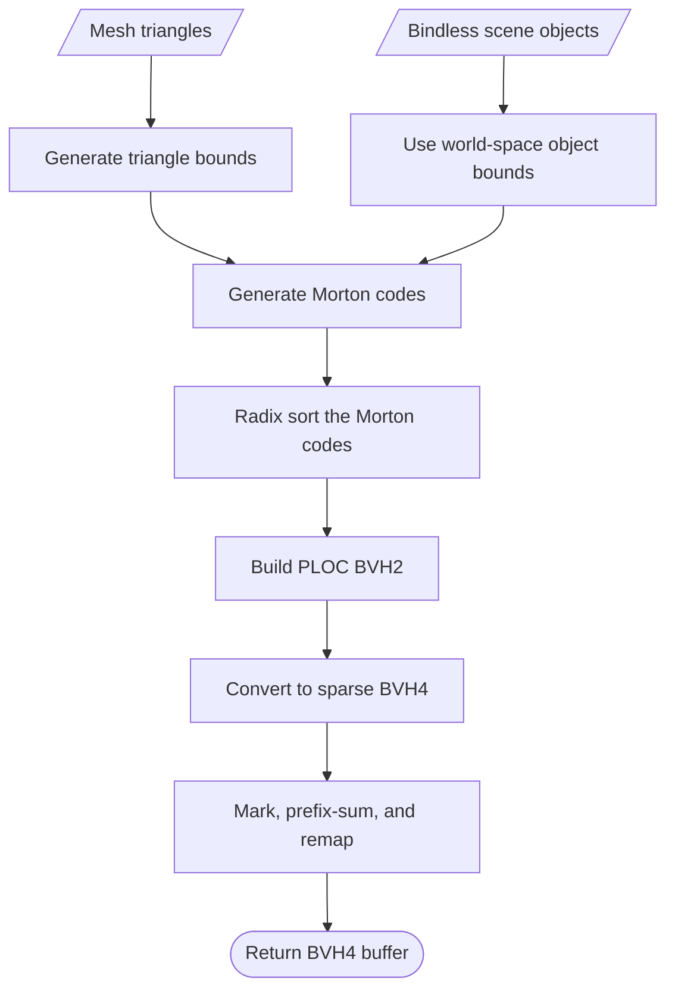
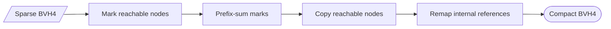
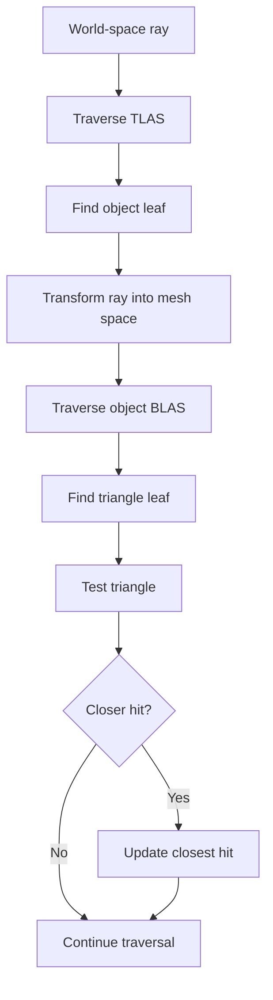

# Raytracing

Cinebara uses a raster rendering pipeline complemented by raytracing capabilities. This document gives a brief overview of the current architecture.

We use a two-level acceleration structure:

- A bottom-level acceleration structure (BLAS) stores the triangles of one mesh.
- A top-level acceleration structure (TLAS) stores the world-space bounds of scene objects.

Both structures use the same GPU generation pipeline. The generator first builds a binary BVH with the PLOC algorithm and then converts it to a BVH4.

The diagram below describes the process of generating a traversable BVH4.



BLAS and TLAS nodes have the same GPU layout, but their leaves have different meanings. A BLAS leaf identifies a triangle, while a TLAS leaf identifies a bindless object.

## Generation functions

`BvhGeneration` supplies two public generation functions:

```kotlin
generateBvh(mesh: Mesh)
generateBvh(sceneBounds: AABB, itemCount: UInt, boundsBuffer: RenderBuffer)
```

The mesh overload creates triangle bounds before running the common builder. The bounds-buffer overload is used by the TLAS and accepts one AABB per scene object.

Generation is scheduled once on the render thread. The returned `StructuredBuffer` is allocated immediately, but deferred GPU commands produce its contents.

## Generation pipeline

### 1. Generate primitive bounds

BLAS generation reads the mesh position and index buffers. A compute shader then writes an AABB for each triangle.

TLAS generation skips this pass because the bindless scene already maintains one world-space AABB per object.

### 2. Generate Morton codes

Another compute shader calculates a Morton code from the center of each item bound relative to the complete mesh or scene bounds. Each code has a one-to-one association with a primitive index.

==- What is a Morton code?
A Morton code is a number that describes a position within a bounded area or volume. The volume is divided into discrete cells, each with its own identifier.

The useful property of Morton encoding is spatial locality. Cells that are close in space will usually have nearby codes because the codes follow a space-filling Z-order curve.

The inverse is also useful: indexing nearby Morton codes will usually produce nearby cells. This gives the merging stage a practical way to search for spatially close primitives without comparing every primitive with every other primitive.

[More about Morton codes](https://en.wikipedia.org/wiki/Z-order_curve)
===

### 3. Sort Morton codes

Morton codes are only useful for neighbour searches after they have been sorted. We perform four byte-wide passes of a radix sort over the 32-bit codes. Each pass processes one byte and contains histogram, scan, and scatter compute stages.

The associated primitive indices move with the codes, preserving the one-to-one mapping created during Morton code generation.

If the details interest you, read [Introduction to GPU Radix Sort](https://gpuopen.com/download/Introduction_to_GPU_Radix_Sort.pdf) by AMD.

The result is a spatially ordered primitive-index buffer.

*This is probably the most expensive part of BVH generation.*

### 4. Build a BVH2 with PLOC

==- What is a BVH2?
A BVH is a bounding volume hierarchy. It is a tree in which every node contains bounds that can be tested before descending farther into the tree.

The "2" in BVH2 means that each internal node has two children. Put another way, a BVH2 is a binary tree.
===

With the bounds gathered and the Morton codes generated and sorted, BVH construction can begin. A compute shader initializes one cluster per primitive. It then repeatedly finds nearby clusters, merges mutual nearest neighbours, prefix-scans the valid clusters, and compacts the active list.

A cluster stores the bounds of a node and the indices of its children. Each cluster lives in a buffer, giving it an implicit index that can be used to identify it. The process continues until only one cluster remains, which becomes the root of the BVH2.

Nearest neighbours are found by testing clusters with nearby positions in Morton order. Each cluster reports its preferred neighbour to a shared buffer. Two clusters merge only when they select each other. This prevents several clusters from merging with the same neighbour.

The prefix scan is a parallel process for accumulating values in a sequence. Here, the input is a list of values indicating whether each cluster remains valid. A cluster becomes invalid when it is absorbed by another cluster.

For example, if the third and fourth clusters have been removed, an exclusive prefix scan produces:

```text
Input:  1 1 0 0 1 1 1 1
Output: 0 1 2 2 2 3 4 5
```

Each valid cluster uses its output value as its new compacted index. The total number of valid clusters is the final prefix value plus the final input value, which is six in this example.

Dispatch sizes are generated on the GPU. If the available PLOC rounds leave more than one cluster, cleanup rounds merge adjacent clusters until one root remains. A final pass copies that root to binary node index `2 × itemCount − 2`.

```wgsl A BVH2 node
struct BvhNode {
    aabbMin: vec3<f32>,
    leftChild: u32,
    aabbMax: vec3<f32>,
    rightChild: u32,
}
```

`rightChild == 0xffffffff` identifies a leaf. In a leaf, `leftChild` stores the primitive index.

### 5. Convert the BVH2 to a BVH4

==- What is a BVH4?
A BVH4 allows each internal node to have up to four children. It is shallower than a BVH2 and lets one traversal step test more bounds at once.

This usually reduces the number of node loads and loop iterations needed to trace a ray. The trade-off is that each node is larger and selecting useful groups of four children becomes important.
===

The converter begins with the two children of each binary node. It then expands internal children until it has found up to four children for the wide node.

When several children could be expanded, the converter compares their surface-area cost. It chooses the expansion expected to produce the smallest increase in traversal work. This preserves the original hierarchy while selecting a more useful four-child frontier.

Each BVH4 node stores the bounds and reference of every child. A child reference can identify either another internal node or a leaf.

```text
bit 31 set    leaf reference
bits 0–30     primitive index
```

For a BLAS, the primitive index identifies a triangle. For a TLAS, it identifies a bindless object. Encoding leaves directly in the parent avoids loading a separate BVH4 leaf node and avoids testing the same leaf bounds twice.

The first conversion produces a sparse BVH4. Its internal references still use indices inherited from the BVH2, so binary nodes absorbed into wider parents leave unused gaps in the buffer.

### 6. Compact the BVH4

Compaction removes those unused gaps without changing the hierarchy.

The sparse root is marked as reachable first. Reachability is then propagated through internal child references. A prefix scan assigns a new contiguous index to each reachable node, after which a final pass copies the nodes and rewrites their internal references.

The compact tree always places its root at index zero. Leaf references do not need to be remapped because they identify primitives rather than BVH nodes.



Compaction can be disabled for comparison:

```kotlin
BvhGeneration.enableBvh4Compaction = false
```

The toggle must be set before scene geometry is created. Existing mesh BLAS buffers are cached and are not regenerated when the toggle changes.

## Using the BVH in a bindless scene

### Mesh acceleration structures

A BLAS is generated the first time a mesh enters the bindless scene. The mesh owns that generated buffer, so several objects using the same mesh can share one BLAS.

The individual mesh BLAS buffers are copied into one shared storage buffer. Each mesh record stores the location and size of its section of this buffer. Each object record stores its mesh, material, transforms, and the root of the mesh BLAS.

This arrangement lets a shader move from an object to its mesh and BLAS using indices. It does not need a separate bind group for each object.

### The scene acceleration structure

The TLAS is built over the world-space bounds of bindless objects. Its leaves identify object records rather than triangles.

Adding, removing, moving, or changing the mesh of an object marks the TLAS as dirty. Before rendering, a dirty TLAS is rebuilt from the current object bounds. The implementation currently rebuilds the complete hierarchy; it does not yet refit bounds through an existing topology.

The scene supplies shaders with the TLAS buffer, its root index, and the number of active objects.

### Bindless raytracing data

The bindless resource group makes the following data available during rasterization and ray queries:

- Packed vertex attributes and indices.
- Per-mesh data and BLAS locations.
- Object transforms, inverse transforms, mesh indices, and material indices.
- World-space object bounds.
- Ray-facing material fallback data and textures.
- The shared BLAS buffer.
- The current TLAS and its root.

Together, these resources allow a ray to move from the scene hierarchy to an object, from the object to a mesh, and from the mesh hierarchy to a triangle without changing bind groups.

## Traversal



Traversal starts at the TLAS root with a world-space ray. At each internal node, the ray is tested against the child bounds. Intersected children are ordered by distance and pushed far-to-near onto a stack. Because the stack is last-in, first-out, the nearest child is processed first.

Finding a close hit early allows farther nodes to be rejected. Their bounds begin beyond the current closest hit and therefore cannot contain a better result.

When traversal reaches a TLAS leaf, it loads the referenced object and transforms the ray into the object's mesh space. BLAS traversal then follows the same process until it reaches triangle leaves.

Triangle intersection is performed in mesh space. Transforming the ray once is less expensive than transforming every candidate triangle into world space. The hit distance remains compatible with the original ray because both the ray origin and direction were transformed by the same affine transform.

If a triangle is closer than the current result, traversal records its object, triangle, distance, and barycentric coordinates. Those values are later used to load and interpolate the surface data at the hit.

The current PBR pass emits one reflection ray for each covered fragment. A successful hit evaluates the material's PBR fallback description and adds the reflected contribution to the rasterized surface.

## Current limitations

- Meshes must use indexed triangle lists.
- A BVH cannot be generated for an empty mesh or scene.
- Bindless stores contain at most 65,536 elements.
- PLOC generation supports at most 65,536 input items.
- Compaction propagates reachability through 64 hierarchy levels.
- Traversal uses fixed-size stacks and records overflows instead of allocating memory dynamically.
- Moving an object rebuilds the TLAS instead of refitting it.
- The compaction mode must be selected before BLAS and TLAS creation.
