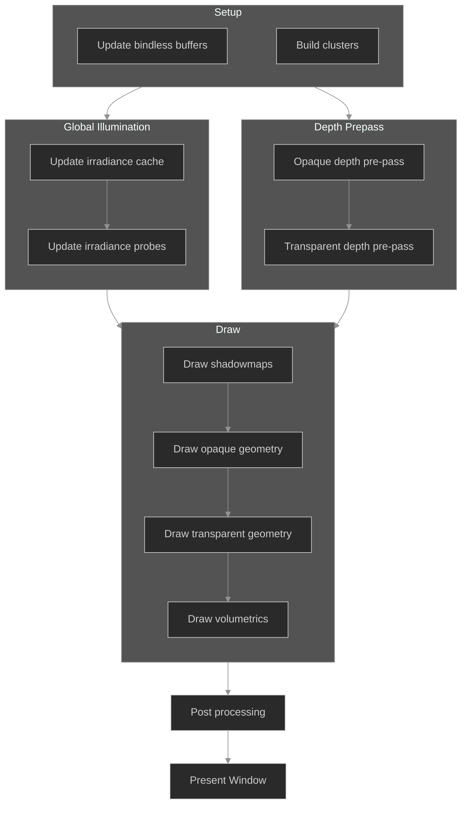

# Rendering

The goal of Cinebara's renderer is to present a high quality image for film. This means that performance typically comes second to fidelity. That being said, you also need to be able to act in Cinebara so expensive operations may be skipped for those purposes. In an ideal world we would not have to consider performance while acting, but this is the digital realm where everything is fighting for CPU/GPU time.

This document is going to be technical. For rendering features, skip to the [features section](#features).

Cinbeara uses a forward clustered pipeline with bindless dispatch where possible. An outline of the pipeline flow is as follows:

<style>
    .dark\:bg-white {
        background: transparent
    }
</style>



This graph is a gross over-simplification of the rendering pipeline, but it's helpful to get a feeling for it. You may click on any of the steps to skip to details about how it works.

---

# Bindless Rendering

!!!warning
Bindless rendering is in active development
!!!

==- :icon-cinebara-question: What is "Bindless Rendering"?
Instead of drawing each object one by one by binding globals (camera data, lights, etc...), binding the mesh / materials, and then drawing, you instead prepare all of the resources that will be used and bind them together. You can then draw objects one by one, in groups, or all together.

It's a bit more involved than that, so if you are interested in how it works, check out [this guide](https://vkguide.dev/docs/gpudriven/gpu_driven_engines/#bindless-design) for Vulkan.
===

Most geometry in the world should be put through the bindless system as the resources will be required for ray-traced effects like [Global Illumination](#global-illumination). Unfortunately, some pipelines may want to draw their geometry in a custom way which the bindless system cannot account for. For this reason, shaders are split into 2 camps: Shader & BindlessShader. As may be evident, Bindless Shaders are the only ones which contribute to the bindless buffers.

Once all of the objects which will contribute to the bindless buffers have been collected, it is time to actually populate the buffers. There are 5 such buffers to fill, and each one contains an array of some structure. 

!!!
You do not need to read about all of the buffers right now. You can refer back to them as they are mentioned throughout the page.
!!!

==- Objects Buffer

This one is the most simple to understand. Each entry defines the data for one object in the bindless scene. An object is a mesh with a material placed at some location, and so we have a `transform` which is an affine transformation matrix, a `meshIndex` which supplies an index into the `meshSlices` buffer, and a `materialIndex` which supplies an index into the `materials` buffer.

```wgsl Definition
struct Object {
    transform: mat4x4<f32>,
    meshIndex: u32,
    materialIndex: u32,
}

var<storage, read> objects: array<Object>;
```

So once you have an `Object` you have everything you need to render it. Accessing the object you need is done by indexing the `objects` buffer with `instance_index` (supplied by the indirect draw function).

```wgsl Usage
@vertex
fn vert(@builtin(instance_index) instance_index: u32) -> VertOutput {
    ...
    var object = objects[instance_index];
    ...
}
```

==- Mesh Attributes Buffer

All attributes of all meshes are tightly packed in this one (potentially massive) buffer.

```wgsl Definition
var<storage, read> meshAttributes: array<f32>;
```

Using a single triangle for example contents of the buffer:

``` A triangle stored in a packed buffer
[
    # positions
    -0.5, 0.0, 0.0,
     0.5, 0.0, 0.0,
     0.0, 1.0, 0.0,

     # texture coordinates
     0.0, 0.0,
     1.0, 0.0,
     0.5, 1.0,
    ...
]
```

The first 9 entries account for 3 positions, stored as 3 `vec3<f32>`. The 6 entries after account for the texture coordinates, stored as 3 `vec2<f32>`. We say that the triangle's positions are stored in the slice `0..8` and the texture coordinates in the slice `9..14`.
The real buffer also stores normals and colors, but those are hidden for demonstration purposes. Of course, the buffer doesn't really "know" where different meshes attribute slices are... that information is stored in the next buffer, the `meshSlices` buffer".

==- Mesh Slice Buffer

As mentioned above, this buffer is responsible for storing the locations of mesh attributes within the `meshAttributes` buffer. Each attribute is given a `vec2<u32>` which describes the position and offset into the `meshAttributes` buffer. 

```wgsl Definition
struct MeshSlices {
    positions: vec2<u32>,
    normals: vec2<u32>,
    colors: vec2<u32>,
    texcoords: vec2<u32>
}

var<storage, read> meshSlices: array<MeshSlices>;
```

Back to the triangle example, the data might look something like this:

```
positions = vec2(0u, 9u);
normals = vec2(9u, 9u);
colors = vec2(18u, u12);
texcoords = vec2(21u, 6u);
```

Suppose I want to access the color of a vertex with index `vertex_index`. Colors are stored with 4 components, so I access each vertex's color by taking `vertex_index` and multiplying it by the "stride" of the attribute I want to access.

```wgsl
let slices = meshSlices[object.meshIndex]; // More on this in the "Object Buffer" part
let colorOffset = slices.colors.x + vertex_index * 4u; // 4u is the "stride" of a color (4 floats, rgba)
let color = vec4(
    meshAttributes[offset]
    meshAttributes[offset + 1]
    meshAttributes[offset + 2]
    meshAttributes[offset + 3]
);
```

==- Index Buffer

The last thing needed to define a mesh is the triangle indices. Bindless rendering is done on meshes with "Triangle List" topology. This means that every 3 entries in the index buffer define 1 triangle. The triangle example has the indices `[0, 1, 2]`. This says to construct a triangle from vertices 0, 1, and 2. We already saw how a `vertex_index` is used to find attribute data in the section just above, so I wont go over it again.

The index buffer, as you may expect, is defined as:

```wgsl Definition
var<storage, read> indices: array<u32>;
```

However, this buffer is not actually accessed in the shader directly. Rather, it is used "by the gpu" to call the vertex function during a `drawIndexed` call. In the case of Bindless Rendering, we are specifically using `drawIndexedIndirect` which is a bit more involved than the standard approach. You can read more on this in the [Indirect Buffer](#indirect_buffer) section.

==- Material Buffer

This is the most implementation specific buffer, and is not at all generalized. I want to improve this one day by allowing many different material structures, but for now:

```wgsl Definition
struct Material {
    diffuse_map: u32,
    specular_map: u32,
    roughness_map: u32,
    normal_map: u32,
    ao_map: u32,
}

var<storage, read> materials: array<Material>;
```

We have a struct which defines an index for all of the textures used within a particular Object's material. This struct will need to be expanded as more configurations are made available to the bindless pipeline. Access to the buffer is done using `object.materialIndex`, just like how mesh data is accessed.

```wgsl Usage
@vertex
fn vert(@builtin(instance_index) instance_index: u32) -> VertOutput {
    ...
    var object = objects[instance_index];
    var material = materials[object.materialIndex];
    ...
}
```

In a real implementation you would want to pass `materialIndex` to the fragment shader.

==- Indirect Buffer {#indirect_buffer}

This one is used for a special mode of drawing called "Indirect Rendering". It is sometimes referred to as "GPU driven rendering", but really it's only one part of that process. The way a typical draw is called is like this:

1. Set the pipeline (Tells the api what shader to use, the mesh topology, etc...)
2. Bind vertex buffers
3. Bind index buffer
4. Call `drawIndexed`

This would then be repeated for each mesh you want to draw... that's really inefficient. All of this binding and drawing incurs a lot of overhead for reasons that are too complicated to explain here. To get around this, we use indirect draws.

An indirect draw requires putting all of the instructions needed to perform many draws in a buffer stored on the GPU. Since the instructions for the draws are already present on the GPU, it can autonomously perform each draw in the buffer without any further communication with the CPU.

```wgsl Definition
struct IndirectIndexedDraw {
    indexCount: u32,
    instanceCount: u32,
    firstIndex: u32,
    baseVertex: i32,
    firstInstance: u32,
}

var draws: array<IndirectIndexedDraw>;
```

It is worth noting that just like the `index` buffer, we don't actually interact with the draws buffer in the shader. Instead, this buffer is passed to the `drawIndexedIndirect` function.

Also, we do not use the `baseVertex` field (set to 0) as we aren't binding any actual vertex buffers. Rather, we just use a storage buffer for the `meshAttributes` and `meshSlices` buffers.

Of course, this method requires binding all of the resources needed for every draw before the indirect draw is called... which just so happens to be exactly what we have done with the other buffers.

==-

With the buffers defined, populating them follows this process:

> for each object in the scene
> 1. Add mesh attribute data to the `meshAttributes` buffer, remembering the slice offsets and lengths they were inserted at.
> 2. Store the attribute slices in the `meshSlices` buffer, remembering the index it was inserted at.
> 3. Add mesh indices to the `index` buffer, remembering the offset and length it was inserted at.
> 4. Add material data to the `materials` buffer, remembering the index it was inserted at.
> 5. Add each object to the `objects` buffer using the remembered indices from `meshSlices` and `materials` as well as the transform of the object. Also remember the index this was inserted at.
> 6. Add an indirect draw instruction to the `indirect` buffer using the remembered `index` buffer slice and the object index as the `firstInstance`.    

So this is great for initializing the buffers, but it might be quite slow if we intend to have many thousands of objects in the scene (we do). An optimization is to only update parts of the buffers which have changed each frame. This dramatically reduces how much work needs to be done, but such an optimzation should not be so hastily applied to the indirect buffer. The draws defined in the indirect buffer happen sequentially, and for the purposes of seeing a consistent result, we should rebuild the buffer with the order of objects defined in the hierarchy of the stage we are rendering.

---

# Clustered rendering

!!!warning
Clustered rendering is not yet implemented
!!!

Forward rendering pipelines have a problem with large amounts of lights. Traditionally, all lights that may affect an object are passed in to the draw function for that object. This is problematic with large objects as many lights could be passed in, meaning that pixels which are nowhere near the light source still have to compute the result of that light. Not efficient.

Clustered rendering aims to solve this providing the list of lights globally in a spatial mapping rather than a per-object mapping. The abstract is this: Split the world into a 3D grid of "buckets". For each bucket, add all lights that are in range to have an effect on it. When drawing a mesh, check the world position of the pixel being drawn and find which bucket it is in to retrieve the list of lights to draw.

!!!
Most clustered forward pipelines use a view space grid (frustum shaped) instead of a world space grid to be more spatially efficient with the buckets. Cinebara utilizes raytracing which also wants to sample from these buckets, and since raytracing may go far beyond the view frustum, we use a world based grid centered around the camera instead.
!!!

To make this easier to follow, I will work from the smallest concept up to the full data structure.

## A single cluster

The final data structure will hold many clusters. A cluster is a region definable with a world-space AABB which holds a list of items which may have an effect on any position sampled within its bounds. It is worth noting that the bounds of the clusters aren't actually defined anywhere- Rather, they are a helpful tool to explain what a cluster is. The bounds do conceptually exist as each cluster is attributed to some region in world-space, but this relationship is implicitly inherited from the cascade it is within.

Items are added to cells based on if the item can possibly have an effect on any position sampled within the cell. A light, for the sake of performance, has a maximum range of effect. Any light whose sphere of influence intersects the bounds of the cell should be included in the item list of the cell.

## A single cascade layer

A 3D grid of clusters forms one layer of the full data structure, a "cascade". Each cluster is tightly spatially packed with its neighbours. The cascade is defined with an AABB. This is where the clusters get their "implicit AABB" mentioned prior.

```wgsl Definition
struct ClusterCascade {
    min: vec3f,
    max: vec3f,
    clusters: array<Cluster>
}
```

Indexing into a cascade is done as follows:

```wgsl
let cascadeSize: u32 = 16u;

fn getClusterIndex(cascade: ClusterCascade, position: vec3f) -> u32 {
    let uvw = (position - cascade.min) / (cascade.max - cascade.min);
    let clusterId = floor(uvw * vec3f(cascadeSize));
    return 
        (clusterId.x * cascadeSize * cascadeSize) +
        (clusterId.y * cascadeSize) +
        clusterId.z;
}
```

This can then be used to access the clusters array.

```wgsl Accessing the clusters array
fn getCluster(cascade: ClusterCascade, position: vec3f) -> Cluster {
    return cascade.clusters[getClusterIndex(cluster, position)];
}
```

!!!warning
These functions assumes the position is within the bounds of the cascade.
!!!

## Stacked cascades

Overlapping multiple cascades with increasing sizes gets you the final data structure. Each cascade is twice the size of the previous one, meaning if you started at a cascade size of 16 meters, then by the 6th cascade the size grows to 512 meters. When deciding which cascade to sample, we always prefer the smallest cascade as it provides the most strict cluster bounds for objects to effect and therefor reduces total time spent processing each item in the cluster.

!!!question Open concern
Far away clusters could be very large and have a lot of items. This could be really bad for performance if you are viewing a complex scene from far away!
!!!

## Updating the clusters

---

## Global Illumination

## Features

An overview of the rendering features that are planned or available in Cinebara.

### PBR

### Raytracing

### Volumetrics
