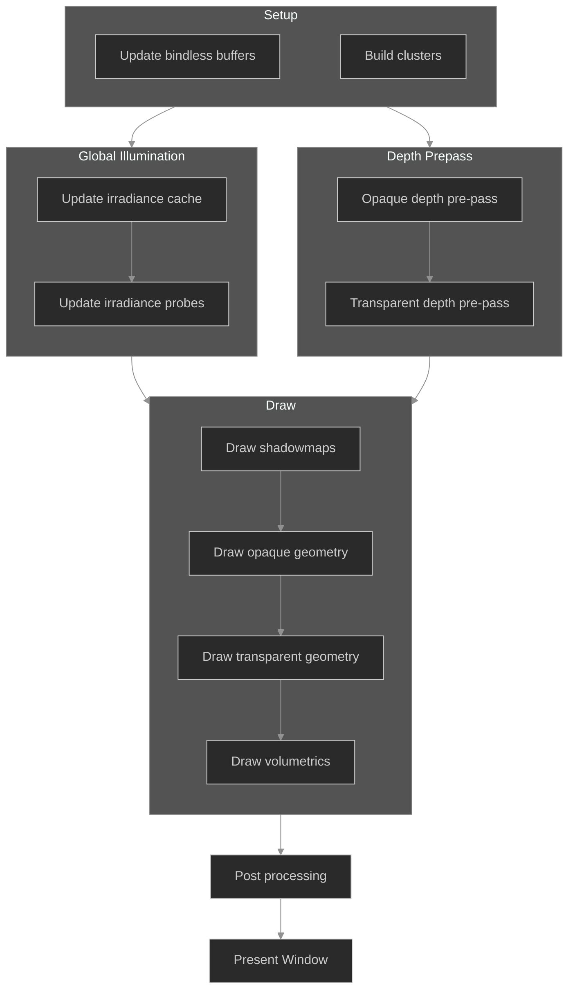

# Rendering

The goal of Cinebara's renderer is to present a high quality image for film. This means that performance typically comes second to fidelity. That being said, you also need to be able to act in Cinebara so expensive operations may be skipped for those purposes. In an ideal world we would not have to consider performance while acting, but this is the digital realm where everything is fighting for CPU/GPU time.

This document is going to be technical. For rendering features, skip to the [features section](#features).

Cinebara uses a forward clustered pipeline with bindless dispatch where possible. An outline of the planned pipeline flow is as follows:

<style>
    .dark\:bg-white {
        background: transparent
    }
</style>


```mermaid
---
config:
    theme: dark
    themeVariables:
        lineColor: 'rgb(145, 145, 145)'
        mainBkg: 'rgb(42, 42, 42)'
        clusterBorder: 'rgba(128, 128, 128, 1)'
---

flowchart TB
bindless_setup[Update bindless buffers]
build_clusters[Build clusters]
update_irradiance[Update irradiance cache]
update_irradiance_probes[Update irradiance probes]
draw_shadowmaps[Draw shadowmaps]
opaque_prepass[Opaque depth pre-pass]
draw_opaque[Draw opaque geometry]
transparent_prepass[Transparent depth pre-pass]
draw_transparent[Draw transparent geometry]
draw_volumetrics[Draw volumetrics]
post_processing[Post processing]
present[Present Window]

subgraph setup[Setup]
    bindless_setup~~~build_clusters
end

subgraph gi[Global Illumination]
    direction TB
    update_irradiance-->update_irradiance_probes
end

subgraph depth_prepass[Depth Prepass]
    direction TB
    opaque_prepass-->transparent_prepass
end

subgraph draw[Draw]
    direction TB
    draw_shadowmaps-->draw_opaque-->draw_transparent-->draw_volumetrics
end

setup-->gi & depth_prepass-->draw-->post_processing-->present
```

This graph is a gross over-simplification of the rendering pipeline, but it's helpful to get a feeling for it. You may click on any of the steps to skip to details about how it works.

---

# Bindless Rendering

!!!warning
Bindless rendering is in active development
!!!

==- :icon-cinebara-question: What is "Bindless Rendering"?
Instead of drawing each object one by one by binding globals (camera data, lights, etc...), binding the mesh / materials, and then drawing, you instead prepare all of the resources that will be used and bind them together. You can then draw objects one by one, in groups, or all together.

It's a bit more involved than that, so if you are interested in how it works, check out [this guide](https://vkguide.dev/docs/gpudriven/gpu_driven_engines/#bindless-design) for Vulkan.
===

Most geometry in the world should be put through the bindless system as the resources will be required for ray-traced effects like [Global Illumination](#global-illumination). Unfortunately, some pipelines may want to draw their geometry in a custom way which the bindless system cannot account for. For this reason, shaders are split into 2 camps: Shader & BindlessShader. As may be evident, Bindless Shaders are the only ones which contribute to the bindless buffers.

Once all of the objects which will contribute to the bindless buffers have been collected, it is time to actually populate the buffers. The five core scene buffers are described below. The implemented bind group also contains the texture array and sampler, object bounds, raytracing acceleration structures, raytracing scene configuration, BLAS pages, and clustered-lighting resources.

!!!
You do not need to read about all of the buffers right now. You can refer back to them as they are mentioned throughout the page.
!!!

==- Objects Buffer

This one is the most simple to understand. Each entry defines the data for one object in the bindless scene. An object is a mesh with a material placed at some location. The implemented record contains its transform and inverse transform, indices into the mesh and material buffers, the root of its bottom-level acceleration structure, and a flags field reserved for future use.

```wgsl Definition
struct Object {
    transform: mat4x4<f32>,
    inverse_transform: mat4x4<f32>,
    mesh: u32,
    material: u32,
    blas_root: u32,
    flags: u32,
}

var<storage, read> objects: array<Object>;
```

World-space object bounds are stored separately for top-level BVH generation. Accessing the object needed for rasterization is done by indexing the `objects` buffer with `instance_index` supplied by the indirect draw function.

```wgsl Usage
@vertex
fn vert(@builtin(instance_index) instance_index: u32) -> VertOutput {
    ...
    var object = objects[instance_index];
    ...
}
```

==- Mesh Attributes Buffer

All attributes of all meshes are tightly packed in this one (potentially massive) buffer.

```wgsl Definition
var<storage, read> meshAttributes: array<f32>;
```

Using a single triangle for example contents of the buffer:

``` A triangle stored in a packed buffer
[
    # positions
    -0.5, 0.0, 0.0,
     0.5, 0.0, 0.0,
     0.0, 1.0, 0.0,

     # texture coordinates
     0.0, 0.0,
     1.0, 0.0,
     0.5, 1.0,
    ...
]
```

The first 9 entries account for 3 positions, stored as 3 `vec3<f32>`. The 6 entries after account for the texture coordinates, stored as 3 `vec2<f32>`. We say that the triangle's positions are stored in the slice `0..8` and the texture coordinates in the slice `9..14`.
The real buffer also stores normals and colors, but those are hidden for demonstration purposes. Of course, the buffer doesn't really "know" where different meshes attribute slices are... that information is stored in the next buffer, the `meshSlices` buffer".

==- Mesh Slice Buffer

As mentioned above, this buffer is responsible for storing the locations of mesh attributes within the `meshAttributes` buffer. Each attribute is given a `vec2<u32>` which describes the position and offset into the `meshAttributes` buffer. 

```wgsl Definition
struct MeshSlices {
    positions: vec2<u32>,
    normals: vec2<u32>,
    colors: vec2<u32>,
    texcoords: vec2<u32>,
    indices: vec2<u32>,
    blas: vec2<u32>,
}

var<storage, read> meshSlices: array<MeshSlices>;
```

Back to the triangle example, the data might look something like this:

```
positions = vec2(0u, 9u);
normals = vec2(9u, 9u);
colors = vec2(18u, u12);
texcoords = vec2(21u, 6u);
```

Suppose I want to access the color of a vertex with index `vertex_index`. Colors are stored with 4 components, so I access each vertex's color by taking `vertex_index` and multiplying it by the "stride" of the attribute I want to access.

```wgsl
let slices = meshSlices[object.mesh]; // More on this in the "Object Buffer" part
let colorOffset = slices.colors.x + vertex_index * 4u; // 4u is the "stride" of a color (4 floats, rgba)
let color = vec4(
    meshAttributes[offset]
    meshAttributes[offset + 1]
    meshAttributes[offset + 2]
    meshAttributes[offset + 3]
);
```

==- Index Buffer

The last thing needed to define a mesh is the triangle indices. Bindless rendering is done on meshes with "Triangle List" topology. This means that every 3 entries in the index buffer define 1 triangle. The triangle example has the indices `[0, 1, 2]`. This says to construct a triangle from vertices 0, 1, and 2. We already saw how a `vertex_index` is used to find attribute data in the section just above, so I wont go over it again.

The index buffer, as you may expect, is defined as:

```wgsl Definition
var<storage, read> indices: array<u32>;
```

However, this buffer is not actually accessed in the shader directly. Rather, it is used "by the gpu" to call the vertex function during a `drawIndexed` call. In the case of Bindless Rendering, we are specifically using `drawIndexedIndirect` which is a bit more involved than the standard approach. You can read more on this in the [Indirect Buffer](#indirect_buffer) section.

==- Material Buffer

This is the most implementation specific buffer, and is not at all generalized. I want to improve this one day by allowing many different material structures, but for now:

```wgsl Definition
struct Material {
    diffuseColor: u32,
    diffuseWeight: f32,
    diffuseRoughness: f32,
}

var<storage, read> materials: array<Material>;
```

The current material record represents one OpenPBR diffuse layer. `diffuseColor` indexes the bindless texture array, while weight and roughness are scalar layer properties. Roughness is uploaded but is not yet consumed by the PBR fragment shader. Access to the buffer is done using `object.material`, just like mesh data is accessed.

```wgsl Usage
@vertex
fn vert(@builtin(instance_index) instance_index: u32) -> VertOutput {
    ...
    var object = objects[instance_index];
    var material = materials[object.material];
    ...
}
```

The vertex shader passes the material index to the fragment shader using flat interpolation.

==- Indirect Buffer {#indirect_buffer}

This one is used for a special mode of drawing called "Indirect Rendering". It is sometimes referred to as "GPU driven rendering", but really it's only one part of that process. The way a typical draw is called is like this:

1. Set the pipeline (Tells the api what shader to use, the mesh topology, etc...)
2. Bind vertex buffers
3. Bind index buffer
4. Call `drawIndexed`

This would then be repeated for each mesh you want to draw... that's really inefficient. All of this binding and drawing incurs a lot of overhead for reasons that are too complicated to explain here. To get around this, we use indirect draws.

An indirect draw requires putting all of the instructions needed to perform many draws in a buffer stored on the GPU. Since the instructions for the draws are already present on the GPU, it can autonomously perform each draw in the buffer without any further communication with the CPU.

```wgsl Definition
struct IndirectIndexedDraw {
    indexCount: u32,
    instanceCount: u32,
    firstIndex: u32,
    baseVertex: i32,
    firstInstance: u32,
}

var draws: array<IndirectIndexedDraw>;
```

It is worth noting that just like the `index` buffer, we don't actually interact with the draws buffer in the shader. Instead, this buffer is passed to the `drawIndexedIndirect` function.

Also, we do not use the `baseVertex` field (set to 0) as we aren't binding any actual vertex buffers. Rather, we just use a storage buffer for the `meshAttributes` and `meshSlices` buffers.

Of course, this method requires binding all of the resources needed for every draw before the indirect draw is called... which just so happens to be exactly what we have done with the other buffers.

==-

With the buffers defined, populating them follows this process:

> for each object in the scene
> 1. Add mesh attribute data to the `meshAttributes` buffer, remembering the slice offsets and lengths they were inserted at.
> 2. Store the attribute slices in the `meshSlices` buffer, remembering the index it was inserted at.
> 3. Add mesh indices to the `index` buffer, remembering the offset and length it was inserted at.
> 4. Add material data to the `materials` buffer, remembering the index it was inserted at.
> 5. Add each object to the `objects` buffer using the remembered indices from `meshSlices` and `materials` as well as the transform of the object. Also remember the index this was inserted at.
> 6. Add an indirect draw instruction to the `indirect` buffer using the remembered `index` buffer slice and the object index as the `firstInstance`.    

The implementation updates changed resource slices and rebuilds the indirect buffer when the bindless scene is dirty. Active objects are compacted into contiguous GPU indices, and the indirect commands follow that compacted resource order. Objects sharing a shader and material configuration can be submitted with one multi-draw-indirect call; incompatible materials are drawn with individual indirect commands. The planned replacement for this simple ordering is described below.

## Visibility and draw ordering

!!!warning
Frustum culling, material draw categories, and depth-sorted indirect commands are not yet implemented.
!!!

Not every object in the bindless scene needs to be drawn by every camera. Objects behind the camera or beyond its view should remain available to raytracing, but submitting raster draw commands for them would be a waste. Before building the draw list, we will query the camera's frustum against the world-space bounds already stored for each object. The visible results are then divided into two categories:

==- Opaque

An opaque material either covers a sample or does not. Its alpha cutoff may be configured so every triangle sample passes, producing a solid surface, or so fragments below the cutoff are discarded, producing holes such as those needed for leaves and fences.

Opaque objects test and write depth, and are drawn from front to back. Drawing the closest objects first fills the depth buffer early, allowing fragments hidden behind them to be rejected before expensive material shading is performed. The depth and color passes should execute the same alpha-cutoff test so they agree on which samples are covered.

==- Blended

A blended material may partially cover a pixel. It tests against the opaque depth buffer. Conventional alpha blending depends on previous color, so these objects are drawn from back to front after opaque geometry.

==-

The distinction between opaque and blended must be stated explicitly by the material. A blend equation only describes how source and destination colors are combined and does not tell the renderer whether the material should write depth or enter a reverse ordered transparent pass.

### Frustum culling

Testing every object's AABB against every camera works, but scales linearly with the size of the scene. Cinebara uses a `LooseOctree` which can reduce the number of bounds tests dramatically. Each object is inserted according to the center and size of its world-space AABB. Larger objects stay near the top of the tree while smaller objects can be placed deeper within it.

The "loose" part means that a node's query bounds are expanded beyond its strict octant. An object can extend across the edge of its cell while still belonging to a single node, avoiding duplication across multiple branches.

The octree supports a custom overlap function which maps neatly onto a frustum query:

1. If a node's loose bounds are outside any frustum plane, skip that node and all of its children.
2. If the bounds are completely inside every plane, accept every object below the node without any more frustum tests.
3. If the bounds overlap the frustum, test the objects held by the node and continue into its children.

Objects whose transforms or deformations change are removed and reinserted when their world-space bounds change. If an object moves outside the octree's root bounds, the tree must be rebuilt with a root large enough to contain the scene. This structure is only used to produce the raster visibility list: culling an object from one camera does not remove it from bindless storage or from the acceleration structures used for raytracing.

### Depth sorting

Sorting only the center of an object can give poor results for large bounds. Instead, project the center and extents of its AABB onto the camera's forward axis to find its nearest and furthest depths.

```kotlin
centerDepth = dot(boundsCenter - cameraPosition, cameraForward)
radius = dot(boundsExtents, abs(cameraForward))

nearestDepth = centerDepth - radius
furthestDepth = centerDepth + radius
```

Opaque objects are sorted by `nearestDepth` from lowest to highest. Blended objects are sorted by `furthestDepth` from highest to lowest. When two values are equal, the object's insertion order is used.

Objects using compatible shaders and pipeline configurations are collected into indirect-draw groups. Each opaque group is ordered front to back, and each blended group is ordered back to front. Grouping means the ordering is not necessarily exact between incompatible pipelines, but avoids throwing away the reason bindless multi-draw exists in the first place.

The depth pre-pass consumes the visible opaque objects in a globally front-to-back order, executes their alpha cutoff, and writes only their depth. The following opaque color pass disables depth writes, executes the same cutoff, and uses an `Equal` depth comparison. Only the surface which produced the stored depth is allowed to run the expensive fragment shader, completely avoiding opaque shading overdraw regardless of how the later color pass is grouped. The pre-pass and color pass must use identical vertex positions, cutoff values, depth bias, clipping, and multisample state or their coverage and depth values may disagree.

Object sorting cannot solve every transparency problem. Intersecting transparent objects can disagree about which one is in front across different pixels, and triangles within a single mesh are not reordered. Those cases will require meshes to be split or a future order-independent transparency technique. Such a technique is currently under discussion.

---

# Clustered rendering

!!!warning
Clustered rendering is partially implemented. Light upload and the cluster compute infrastructure exist, but cascades are not initialized and the PBR shader currently evaluates only directional lights.
!!!

Forward rendering pipelines have a problem with large amounts of lights. Traditionally, all lights that may affect an object are passed in to the draw function for that object. This is problematic with large objects as many lights could be passed in, meaning that pixels which are nowhere near the light source still have to compute the result of that light. Not efficient.

Clustered rendering aims to solve this providing the list of lights globally in a spatial mapping rather than a per-object mapping. The abstract is this: Split the world into a 3D grid of "buckets". For each bucket, add all lights that are in range to have an effect on it. When drawing a mesh, check the world position of the pixel being drawn and find which bucket it is in to retrieve the list of lights to draw.

!!!
Most clustered forward pipelines use a view space grid (frustum shaped) instead of a world space grid to be more spatially efficient with the buckets. Cinebara utilizes raytracing which also wants to sample from these buckets, and since raytracing may go far beyond the view frustum, we use a world based grid centered around the camera instead.
!!!

To make this easier to follow, I will work from the smallest concept up to the full data structure.

## A single cluster

The final data structure will hold many clusters. A cluster is a region definable with a world-space AABB which holds a list of items which may have an effect on any position sampled within its bounds. It is worth noting that the bounds of the clusters aren't actually defined anywhere- Rather, they are a helpful tool to explain what a cluster is. The bounds do conceptually exist as each cluster is attributed to some region in world-space, but this relationship is implicitly inherited from the cascade it is within.

Items are added to clusters based on if the item can possibly have an effect on any position sampled within the cluster. A light, for the sake of performance, has a maximum range of effect. Any light whose sphere of influence intersects the bounds of the cluster should be included in the item list of the cluster.

```wgsl Definition
struct Cluster {
    items: array<u32>,
    count: u32,
}
```

## A single cascade layer

A 3D grid of clusters forms one layer of the full data structure, a "cascade". Each cluster is tightly spatially packed with its neighbours. The cascade is defined with an AABB. This is where the clusters get their "implicit AABB" mentioned prior.

```wgsl Definition
struct ClusterCascade {
    min: vec3f,
    max: vec3f,
}
```

As shown, clusters are stored in a 1D array. Each cluster is given some slice of this array. The size of a cascade's slice is $cascadeSize^3$, so given the index of the cascade, the start offset of the slice would be $cascadeIndex\times cascadeSize^3$

```wgsl Getting a slice into the Clusters array
let cascadeSize: u32 = 16u;

fn getClustersSlice(cascadeIndex: u32) -> vec2<u32> {
    let clustersSliceSize = cascadeSize * cascadeSize * cascadeSize;
    let clustersSliceStart = cascadeIndex * clustersSliceSize;
    return vec2(clusterSliceStart, clustersSliceSize);
}
```

The slice is enough to let us index into the clusters given some xyz offset. The offset is composed of `u32`s.

```wgsl Getting the index of a cluster from xyz offset
...
fn clusterOffsetToIndex(offset: vec3<u32>) -> u32 {
    return
        (offset.x * cascadeSize * cascadeSize) +
        (offset.y * cascadeSize) +
        offset.z;
}
```

!!!warning
This function assumes the position is within the bounds of the cascade.
!!!

## Stacked cascades

Overlapping multiple cascades with increasing sizes gets you the final data structure. Each cascade is twice the size of the previous one, meaning if you started at a cascade size of 16 meters, then by the 6th cascade the size grows to 512 meters. When deciding which cascade to sample, we always prefer the smallest cascade as it provides the most strict cluster bounds for objects to effect and therefor reduces total time spent processing each item in the cluster.

!!!question Open concern
Far away clusters could be very large and have a lot of items. This could be really bad for performance if you are viewing a complex scene from far away!
!!!

## Updating the clusters

All cascades are stored in a contiguous buffer which will be bound for a compute shader to write into. Alongside the cascades is an array of all of the items in the scene.

```wgsl Items Structure
struct ClusterItem {
    transform: mat4x4<f32>,
    min: vec3<f32>,
    max: vec3<f32>,
    id: u32,
}

var<storage, read> items: array<ClusterItem>;
```

An AABB overlap check is done for each item / cluster pair in each cascade to find which items affect which clusters.

The last field in the item is `id`. This is a bit-packed id that describes what the item and what configuration it has. More on this in the section for [sampling the clusters](#sampling-the-clusters).

A compute dispatch is called once for each cascade. The compute process for updating one cascade looks something like this:

```wgsl
...
// Input
var<uniform> cascades: array<ClusterCascade>;
var<storage, read> items: array<ClusterItem>;
var<immediate> cascadeToUpdate: u32;

// Output
var<storage, write> clusters: array<Cluster>;

@compute @workgroup_size(8, 8, 8)
fn updateClusters(@builtin(global_invocation_id) id: vec3<u32>) {
    let cascade = cascades[cascadeToUpdate];

    let targetCluster = clusters[getClusterSlice(cascadeToUpdate).x + clusterOffsetToIndex(id)];
    targetCluster.count = 0u;

    let cascadeRegionSize = cascade.max - cascade.min;
    let clusterRegionSize = cascadeRegionSize / clusterSize;
    let clusterMin = cascade.min + clusterRegionSize * vec3f(id);
    let clusterMax = clusterMin + clusterRegionSize;

    // Find which items belong to this cluster
    for(let i = 0u; i < arrayLength(items); i++) {
        let item = items[i];
        
        if(item.max.x < cluster.min.x || item.max.y < cluster.min.y || item.max.z < cluster.min.z ||
           item.min.x > cluster.max.x || item.min.y > cluster.max.y || item.min.z > cluster.max.z) {
               continue;
           }

        targetCluster[targetCluster.count] = i;
        targetCluster.count++;
    }
}
```

!!!
All cascades should be updated before any real drawing happens, but for performance reasons we might consider to only update one cascade a frame. This would make lights look like they're running at `fps / cascadeCount` frames per second, which clearly isn't ideal. Instead, we update the inner-most cascade every frame, and then amortize the rest of the cascades over `cascadeCount - 1` frames.

In the final output, all cascades are always updated every frame.
!!!

## Sampling the clusters

Given some world position $position$, we want to get the specific cluster to sample and iterate the items of. To do this, we first need to know the smallest cascade we are contained within is. 

Each cascade has extents which are two times larger than the one before it. This means that on each axis, each cascade's "shell" reaches twice as far as the one before it. Let $maxAxis$ be the maximum axis of $|position - clustersOrigin|$, which provides a distance that can be used to figure out which shell we are within. $\lfloor\sqrt\frac{maxAxis}{2}\rfloor$ then provides the index of the shell to sample.

```wgsl Finding the appropriate cascade index
let cascadesCenter: vec3f;

fn getCascadeIndex(position: vec3f) -> u32 {
    let smallestCascadeRegionSize = cascaces[0].max - cascades[0].min;
    let localPosition = (position - cascadesCenter) / smallestCascadeRegionSize;
    let absPosition = abs(localPosition);
    let maxAxis = max(absPosition.x, absPosition.y, absPosition.z);
    return u32(floor(sqrt(maxAxis)));
}
```

This function should always provide the smallest cascade that $position$ is contained within. If the result is greater than the number of cascades minus 1, then you are beyond the bounds of the cascades and should not be sampling from clusters.

With that, we can sample the clusters of the cascade using this function: 

```wgsl Getting the cluster from a world-space position
...

fn getClusterIndex(cascadeIndex: u32, position: vec3f) -> u32 {
    let slice = getClustersSlice(cascadeIndex);

    let cascade = cascades[cascadeIndex];
    let uvw = (position - cascade.min) / (cascade.max - cascade.min);
    let clusterOffset = vec3<u32>(floor(uvw * vec3f(cascadeSize)));
    let clusterIndex = clusterOffsetToIndex(clusterOffset);
    
    return clustersSliceStart + clusterIndex;
}
```

---

## Global Illumination

## Features

An overview of the rendering features that are planned or available in Cinebara.

---

# PBR

We follow the [OpenPBR standard](https://academysoftwarefoundation.github.io/OpenPBR/) with a few modifications. Let's go over the primary structure that makes up the pbr workflow.

A PBR material may have an arbitrary number of layers, each layer defines some special rendering technique and the layers may be blended to achieve emulation of micro-details, like fine scratches on metal providing additional specular highlights.

!!!warning
The current bindless implementation supports one `DiffuseSurface` containing a color texture, weight, and roughness. Raster shading uses the texture RGB, vertex RGB, and weight with a Lambertian diffuse BRDF; roughness is stored but not yet evaluated. The fragment shader currently ignores texture alpha and always outputs an alpha of `1.0`.
!!!

Materials already expose depth writes and comparison, culling, stencil state, alpha-to-coverage, color write masks, and replace, mix, additive, or multiply blending through `MaterialConfiguration`. These states create distinct cached render pipelines. The planned opaque and blended categories described in [Visibility and draw ordering](#visibility-and-draw-ordering) are not yet implemented, and the PBR material has no opacity or alpha-cutoff model yet.

---

### Raytracing

### Volumetrics
