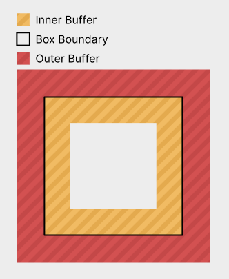
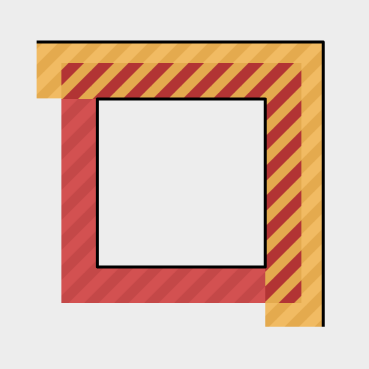

# Core Observations
In many different UI layouts, items are placed side-by-side and then distributed and aligned in some manner.
For this layout system, we have constructed some generic primitives that accomplish this and are used by all layout modes, to handle these common behaviors in a unified way.

These primitives are racks and lines, which are used by all layout modes to achieve their goals.
A rack is a one-dimensional concept responsible for distributing and aligning a set of items into some available space on an axis.
A line generalizes how to treat an entire row of boxes as a single rack item.
This can happen when aligning the rows in a flex layout, but is most common in grid layout, where entire rows and columns are treated as single rack items.

# Box
A box is a core unit of the UI.
For purposes of layout, it is a rectangle, whose size and position are to be determined.
Boxes furthermore have inner and outer buffer regions, which allow them to be spaced from one another.

# Buffer
Buffer is an amount of space around boxes that will not have content placed into it.
Any box can have both inner and outer buffer on all sides.
Outer buffer can be used to space it away from other boxes, whereas inner buffer can provide a margin around its children and an area for any borders to be drawn in.
Buffer collapses with adjacent buffers of siblings and parents.
Buffer never collapses through box boundaries.
Buffer never collapses through gap decorations.
A box's inner buffer has the option to be a strong buffer. This means that arbitrarily large buffers can collapse into it.
This is nice in cases where children might have large buffers to be used for spacing them away from other actual content, but the container's edges can be seen as the end of all content.
The container's inner buffers are also far more concerned with giving an even spacing around children, to make the container look nice or to allow it to tightly wrap its child boxes regardless.
A box's own inner buffers do not collapse with each other. This is because a box's inner buffer on a side is often what provides space for the box's border on that side to sit in. If the buffer collapses away, there might not be enough space for the border.

# Gaps
A gap is a buffer inserted between items in a container.
This includes gaps between things such as flex items and table rows and columns.
It collapses with those item's outer buffers.

# Directions
UI inherently exist in two dimensions, where it has a horizontal direction and a vertical direction. That said, for anything that will contain human text, it makes sense to conceptualize these as a primary and a secondary direction. English text has words going left to right, and if there is not enough space remaining, it wraps onto more lines, going downwards. We thus arrive at our terms for the X and Y axes: The placement direction and the wrapping direction.
Every layout mode performs its layout according to these two directions.

And while in English, these always correspond to the horizontal and vertical axes in the same way, this is not necessarily the case in other languages, such as Arabic or Mongolian. Arabic goes right to left, whereas Mongolian places text top to bottom.

In a UI system, it makes sense for these differences to be represented, even by things that are not text. Think of a menu bar, where the various options are placed left to right, from the most important to the least important. If the language were arabic, it would make sense, for these menu items to go the other direction as well.

Thus, all layout modes operate on the placement and wrapping directions, which may map to the physical X and Y axes in various different ways:

# Layout Modes
Layout modes very roughly follow this logic:
1. Distribute items via racks along the placement axis to determine their sizes in that direction.
2. Run layout for the children now that their sizes in the placement axis are determined.
3. Distribute items via racks in the wrapping direction.
Here, the preferred sizes of any boxes are substituted for the sizes obtained during their layout.
The idea behind this is that a box should, ideally, in the absence of any stretching or size limits, perfectly wrap its contents.

Before laying out a box, it may be of indefinite size along one or both axes. This indicates that the box's own layout has infinite space available in these directions. After a box has been laid out, its size has been resolved to be definite on both axes. Note that at this point, the parent box might, during further distribution, squish the box back down to a smaller size. This will induce overflow.

Imagine an absolutely positioned box that will stretch to fill the entire screen, in a right-to-left, top-to-bottom layout. It first gets a width from the absolute layout. Then its own layout runs, filling that given width and an indefinite height, which might end up larger than the screen. Now the absolute layout squishes this box back down to the size of the screen, inducing overflow.

# Root Layout
The root box is positioned at an origin.
It's self alignment is used to determine how exactly it sits on the origin.
This makes it possible to have boxes of indefinite size that are either centered on a point or grow into a certain direction. (or anything in-between, really)

# Absolute Layout
Absolute layout exists to position boxes relative to their parent, without special alignment with regards to their siblings.
Examples of this include centered modals, popups along the edges of a container and also draggable windows on a desktop.

Absolute layout is performed as follows:

1. Place each child box in its own rack along the placement direction. (These racks also include collapsed end buffers.)

2. Distribute all racks to determine their sizes.

3. If the container does not have a placement axis size yet, its placement axis size is that of the largest rack.

4. Lay out all child boxes.

5. Place each child box in its own rack along the wrapping direction, using its laid-out size as the preferred size. (These racks also include collapsed end buffers.)

6. Distribute the wrapping direction racks to determine their sizes.

7. If the container does not have a wrapping axis size yet, its wrapping axis size is that of the largest wrapping axis rack.

8. Clamp the container's size up to its min size.

9. Align all racks.

This means that the container will resolve indefinite sizes to be at least its min size and also always large enough to fit any item if that item were centered.
Alignment may want to align items to be fully or partially outside of the container and this still allows for that.
It also leaves enough space for those items to slide fully into view.

# Flex Layout
Flex layout exists to lay out items into lines of content that may or may not be allowed to wrap.
Examples of this include toolbars, lines of text, or stacks of messages in a chat history.

# Grid Layout
Grid layout exists to position items in a grid-like arrangement.
This is useful for tables and some general UI concepts.

Grid layout is performed as follows:

Note that any time that this algorithm 'assigns' sizes to colunms, it does not add them to the rack item immediately. It just makes note of them for later use.

1. Assign child boxes to the grid's cells. A box might span multiple cells, horizontally and vertically. TODO: How exactly?

2. Create a rack for the placement direction. This rack has one item for each column, and their properties are determined by a line that consists of each box within that column. Boxes that span multiple colunms are not part of the lines.

3. For each box that spans multiple columns:

	1. If the total min size of all columns that it spans and the gaps between them is less than the spanning box's min size, make note of how much size is missing and proportionally assign it to all columns in question, based on their current sizes.
	Do not assign any additional min size to gaps.

4. For each column, if any min size increases were assigned to it, add the largest of them.
Iterate columns so that the columns with the largest available min size increases are processed first.
Break ties using their second-largest available min size increase and so on. (A non-existant min size increase is smaller than one that does exist.)
If there were any other, smaller min size increases assigned, re-run step 3 for the boxes that those smaller min size increases originated from.
This procedure hopes to unify all desired min size increases in the least egregious way.
If two spanning boxes need to increase a colunms size by different amounts, only the largest increase should be taken, which allows the other spanning box to assign less additional space elsewhere.
One would not want to prioritize smaller min size increases, because this forces boxes that already need a lot of extra min size to take even more elsewhere.
Whereas allowing the demanding spanners to perform their size increases first, might make further size increases for less demanding spanners entirely unnecessary.

5. For each box that spans multiple columns:

	1. If the total preferred size of all columns that it spans and the gaps between them is not equal to the spanning box's preferred size, note how much size is missing.
	In this step, if an item has no preferred size, use its min size in the sum instead.
	Also use its min size if it exceeds its preferred size.
	This models the actual amount of space with which a column will enter the rack distribution algorithm, i.e. its effective preferred size.

	2. If that sum is less than the spanning box's preferred size:

		1. Compute the difference and proportionally assign it to all columns in question, based on their current sizes.
		Do not assign any preferred sizes to gaps or items that already have a set preferred size.
		If this means that there is no items to assign this preferred size to, do not assign it at all.

6. For each column, if any preferred sizes were assigned to it, set its preferred size to the average of all of the assigned ones.

7. Lay out all child boxes.

8. Re-run steps 2 through 6 for the wrapping direction, using the child boxes' laid-out sizes as their preferred sizes.

# Rack
A rack is a set of items in a row that want to be placed next to one another.
A rack is one-dimensional.
There is two operations that can be done on a rack:
1. Distributing the rack
    In this, the rack's items' sizes are determined by placing and stretching them towards the rack's target size.
	They are not assigned any positions, just sizes.
    Items are not stretched if they have a stretch priority of 0 or if the rack's target size is indefinite.
2. Aligning the rack
    In this, the distributed rack is aligned inside of its parent, by placing the rack's self alignment point on the rack's parent alignment point

A rack has:
    - a list of rack items
    - a target size (dots or indefinite)
    - a self alignment (number in the range -1 to 1)
    - a parent alignment (number in the range -1 to 1)

A rack item consists of:
    - a minimum size (dots)
    - a preferred size (dots or indefinite)
    - a maximum size (dots or indefinite)

# Line

Some layouts employ lines, which are a rack item that contains multiple boxes, perpendicular to the rack's direction.
A line's min size is the largest min size found among the boxes within it. (so that it is at least large enough to contain all of them.)
If there is no items within the line, it's min size is 0.
A line's preferred size is the largest preferred size found among the boxes within it. (so that is can comfortably wrap all of them.)
If no item within it has a preferred size, the line has no preferred size.
